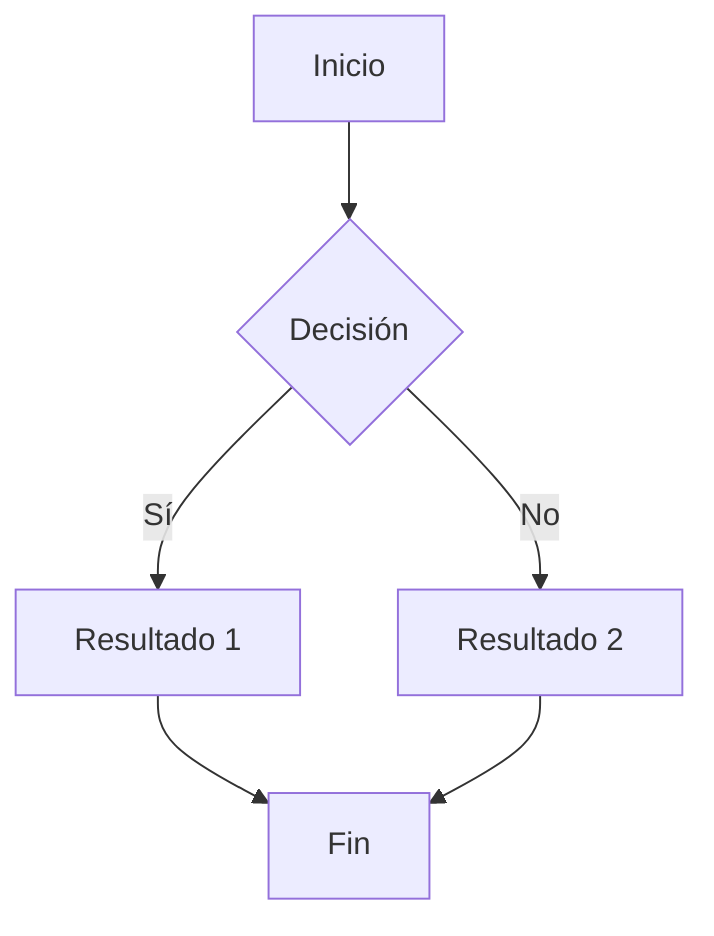
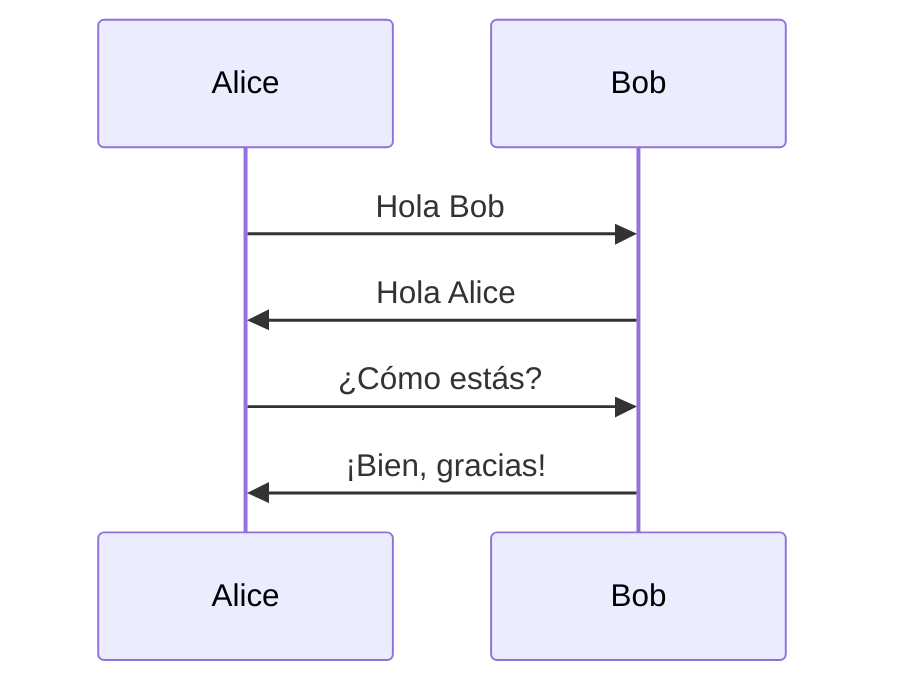

# Guía Completa de Markdown

## Tabla de Contenidos

- [Encabezados](#encabezados)
- [Énfasis y Texto](#énfasis-y-texto)
- [Listas](#listas)
- [Enlaces](#enlaces)
- [Imágenes](#imágenes)
- [Código](#código)
- [Tablas](#tablas)
- [Citas](#citas)
- [Líneas Horizontales](#líneas-horizontales)
- [HTML en Markdown](#html-en-markdown)
- [Caracteres Especiales](#caracteres-especiales)
- [Listas de Tareas](#listas-de-tareas)
- [Notas al Pie](#notas-al-pie)
- [Definiciones](#definiciones)
- [Abreviaciones](#abreviaciones)
- [Emojis](#emojis)

---

## Encabezados

# Encabezado Nivel 1
## Encabezado Nivel 2
### Encabezado Nivel 3
#### Encabezado Nivel 4
##### Encabezado Nivel 5
###### Encabezado Nivel 6

Encabezado Alternativo Nivel 1
==============================

Encabezado Alternativo Nivel 2
------------------------------

## Énfasis y Texto

**Texto en negrita** o __también en negrita__

*Texto en itálica* o _también en itálica_

***Texto en negrita e itálica*** o ___también ambos___

~~Texto tachado~~

==Texto resaltado== (en algunos procesadores)

<mark>Texto marcado con HTML</mark>

<sup>Texto en superíndice</sup> y <sub>texto en subíndice</sub>

++Texto subrayado++ (en algunos procesadores)

`Texto en línea de código`

> **Nota:** No todos los procesadores de Markdown soportan todas estas variantes.

## Listas

### Lista Desordenada

- Elemento 1
- Elemento 2
  - Sub-elemento 2.1
  - Sub-elemento 2.2
    - Sub-sub-elemento 2.2.1
- Elemento 3

* También con asteriscos
* Otro elemento

+ O con signos de más
+ Último elemento

### Lista Ordenada

1. Primer elemento
2. Segundo elemento
   1. Sub-elemento 2.1
   2. Sub-elemento 2.2
3. Tercer elemento

### Lista con Múltiples Párrafos

1. Primer elemento

   Este es un segundo párrafo dentro del primer elemento.

2. Segundo elemento

   > Una cita dentro de una lista
   
   Y más texto aquí.

### Lista de Definiciones

Término 1
: Definición del término 1

Término 2
: Primera definición del término 2
: Segunda definición del término 2

## Enlaces

[Enlace simple](https://www.ejemplo.com)

[Enlace con título](https://www.ejemplo.com "Título del enlace")

[Enlace a una sección](#encabezados)

[Enlace de referencia][referencia-1]

[También puedes usar números][1]

[O usar el mismo texto como referencia]

<https://www.ejemplo-autoenlace.com>

<email@ejemplo.com>

[referencia-1]: https://www.ejemplo-referencia.com
[1]: https://www.ejemplo-numero.com
[O usar el mismo texto como referencia]: https://www.ejemplo-mismo-texto.com

## Imágenes


![Imagen de referencia][imagen-referencia]

[imagen-referencia]: https://via.placeholder.com/200 "Imagen usando referencia"

Imagen con HTML:


## Código

### Código en Línea

Usa el comando `git status` para ver el estado.

### Bloques de Código

```
Código sin resaltado de sintaxis
Simple texto preformateado
```

```python
# Código Python con resaltado
def hola_mundo():
    print("¡Hola, Mundo!")
    return True

class MiClase:
    def __init__(self, nombre):
        self.nombre = nombre
```

```javascript
// Código JavaScript
const saludo = (nombre) => {
  console.log(`Hola, ${nombre}!`);
  return true;
};

saludo("Mundo");
```

```html
<!-- Código HTML -->
<!DOCTYPE html>
<html lang="es">
<head>
    <meta charset="UTF-8">
    <title>Documento</title>
</head>
<body>
    <h1>Hola Mundo</h1>
</body>
</html>
```

```css
/* Código CSS */
.mi-clase {
    color: #333;
    font-size: 16px;
    margin: 10px 0;
}
```

```bash
# Comandos de terminal
cd /home/usuario
ls -la
git commit -m "Mensaje del commit"
```

```json
{
  "nombre": "Ejemplo",
  "version": "1.0.0",
  "descripcion": "Un archivo JSON de ejemplo",
  "activo": true,
  "valores": [1, 2, 3, 4, 5]
}
```

    Bloque de código con indentación
    (4 espacios o 1 tab)
    También funciona

## Tablas

### Tabla Básica

| Encabezado 1 | Encabezado 2 | Encabezado 3 |
|--------------|--------------|--------------|
| Celda 1.1    | Celda 1.2    | Celda 1.3    |
| Celda 2.1    | Celda 2.2    | Celda 2.3    |
| Celda 3.1    | Celda 3.2    | Celda 3.3    |

### Tabla con Alineación

| Izquierda | Centrado | Derecha |
|:----------|:--------:|--------:|
| Texto     | Texto    | Texto   |
| 123       | 456      | 789     |
| A         | B        | C       |

### Tabla con Formato

| Característica | Descripción | Estado |
|----------------|-------------|--------|
| **Negrita** | Texto en negrita | ✅ |
| *Itálica* | Texto en itálica | ✅ |
| `Código` | Código en línea | ✅ |
| ~~Tachado~~ | Texto tachado | ❌ |

## Citas

> Esta es una cita simple.

> Esta es una cita en bloque
> que continúa en múltiples líneas.
> Puede tener varias líneas.

> ### Citas con Formato
> 
> Puedes usar **énfasis** y otros elementos dentro de citas.
> 
> - Incluso listas
> - Como esta

> Citas anidadas:
> > Una cita dentro de otra cita
> > > Y otra más profunda
> > 
> > De vuelta al segundo nivel
> 
> Y de vuelta al primer nivel

## Líneas Horizontales

---

***

___

- - -

* * *

## HTML en Markdown

<div style="background-color: #f0f0f0; padding: 10px; border-radius: 5px;">
  <h4>Sección HTML</h4>
  <p>Puedes usar HTML directamente en Markdown.</p>
  <ul>
    <li>Elemento HTML 1</li>
    <li>Elemento HTML 2</li>
  </ul>
</div>

<details>
<summary>Haz clic para expandir</summary>

Contenido oculto que se revela al hacer clic.

```python
print("Código dentro de detalles")
```

</details>

<kbd>Ctrl</kbd> + <kbd>C</kbd> para copiar

<abbr title="HyperText Markup Language">HTML</abbr>

## Caracteres Especiales

Escapar caracteres especiales con backslash:

\* Sin itálica \*

\_ Sin subrayado \_

\# Sin encabezado

\[ Sin enlace \]

\` Sin código \`

Caracteres especiales:

Copyright: &copy; o ©

Marca registrada: &reg; o ®

Trademark: &trade; o ™

Menor que: &lt; o <

Mayor que: &gt; o >

Ampersand: &amp; o &

Comillas: &quot; o "

Espacio no rompible: &nbsp;

## Listas de Tareas

- [x] Tarea completada
- [x] Otra tarea terminada
- [ ] Tarea pendiente
- [ ] Otra tarea por hacer
  - [x] Sub-tarea completada
  - [ ] Sub-tarea pendiente

## Notas al Pie

Aquí hay un texto con una nota al pie[^1].

También puedes usar notas al pie con nombres[^nota-importante].

Las notas al pie pueden tener múltiples párrafos[^nota-larga].

[^1]: Esta es la primera nota al pie.

[^nota-importante]: Esta es una nota al pie con nombre personalizado.

[^nota-larga]: Esta es una nota al pie más larga.

    Puede contener múltiples párrafos.
    
    Y también código:
    
    ```python
    print("Hola desde la nota al pie")
    ```

## Definiciones

Primer Término
: Esta es la definición del primer término.

Segundo Término
: Esta es una definición del segundo término.
: El segundo término puede tener múltiples definiciones.

## Abreviaciones

*[HTML]: HyperText Markup Language
*[CSS]: Cascading Style Sheets
*[JS]: JavaScript

Cuando uses HTML, CSS o JS en el texto, se mostrarán como abreviaciones (en procesadores que lo soporten).

## Emojis

### Emojis con Códigos

:smile: :heart: :thumbsup: :rocket: :star: :fire: :tada:

:white_check_mark: :x: :warning: :information_source:

:book: :pencil: :computer: :bulb:

### Emojis Unicode Directos

😀 😃 😄 😁 😆 😅 🤣 😂

❤️ 💙 💚 💛 🧡 💜 🖤 🤍

👍 👎 👏 🙌 🤝 🙏

🚀 ⭐ 🔥 💡 📝 💻 📚

✅ ❌ ⚠️ ℹ️ 🎉 🎊 🎈

## Fórmulas Matemáticas

### Fórmulas en Línea (con soporte LaTeX)

La ecuación de Einstein es $E = mc^2$.

El teorema de Pitágoras: $a^2 + b^2 = c^2$.

### Fórmulas en Bloque

$$
\frac{n!}{k!(n-k)!} = \binom{n}{k}
$$

$$
\sum_{i=1}^{n} i = \frac{n(n+1)}{2}
$$

$$
\int_{a}^{b} f(x)dx
$$

$$
\lim_{x \to \infty} \frac{1}{x} = 0
$$

## Diagramas Mermaid





## Citas de Código con Salida

```python
>>> print("Hola, Mundo!")
Hola, Mundo!
>>> 2 + 2
4
>>> [x**2 for x in range(5)]
[0, 1, 4, 9, 16]
```

## Bloques de Información/Advertencia

> [!NOTE]
> Esto es una nota importante.

> [!TIP]
> Esto es un consejo útil.

> [!IMPORTANT]
> Esto es información importante.

> [!WARNING]
> Esto es una advertencia.

> [!CAUTION]
> Esto requiere precaución.

## Comentarios

[//]: # (Este es un comentario que no se renderiza)

[//]: # "También puedes usar comillas"

[comment]: <> (Otra forma de hacer comentarios)

<!-- Este es un comentario HTML que tampoco se renderiza -->

## Combinaciones Avanzadas

### Tabla con Listas

| Característica | Elementos |
|----------------|-----------|
| Lista | <ul><li>Elemento 1</li><li>Elemento 2</li></ul> |
| Código | `function() { return true; }` |

### Cita con Código

> Ejemplo de configuración:
> ```yaml
>   nombre: "Proyecto"
>   version: 1.0
>   version: 1.0
> ```

### Lista con Imágenes y Enlaces

1. Primer elemento con [enlace](https://ejemplo.com)
2. Segundo elemento con código: `const x = 10;`
3. Tercer elemento con imagen: 

## Referencias y Enlaces Automáticos

GitHub: @usuario

Commits: commit-hash

Issues: #123

Pull Requests: #456

## Texto Especial

~~No sólo~~ puedes usar ==resaltado== y **combinarlo** con *otros* `formatos`.

==Puedes **anidar** *diferentes* `tipos` de ~~formato~~==

## Casos Especiales

### Texto Literal

    Este texto preserva
        toda la indentación
            y espacios
                exactamente como está escrito

### Escape de Bloques de Código

Para mostrar código markdown literalmente:

````markdown
```python
print("Este código se muestra como markdown, no se ejecuta")
```
````

## Final del Documento

---

**Nota final:** Este documento contiene prácticamente todos los elementos que Markdown puede renderizar, incluyendo extensiones comunes de GitHub Flavored Markdown (GFM), CommonMark, y otras variantes populares.

*Última actualización: 2026*

© Ejemplo de documento Markdown completo
